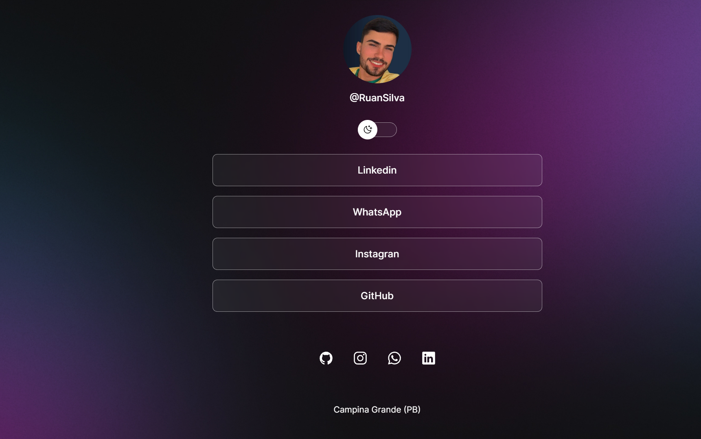
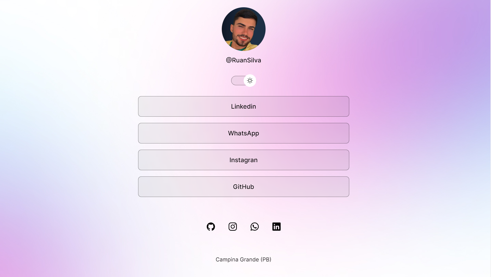

<h1 align="center"> Agregador de Links</h1>

Programa exclusivo e gratuito, com troca de tema que você pode usar como cartão de visitas nas suas redes sociais.

 Promovido pela Rocketseat para ensino de tecnologias.

  

  

## 🚀 Tecnologias

Esse projeto foi desenvolvido com as seguintes tecnologias:

- HTML e CSS
- JavaScript
- Git e Github
- Figma

